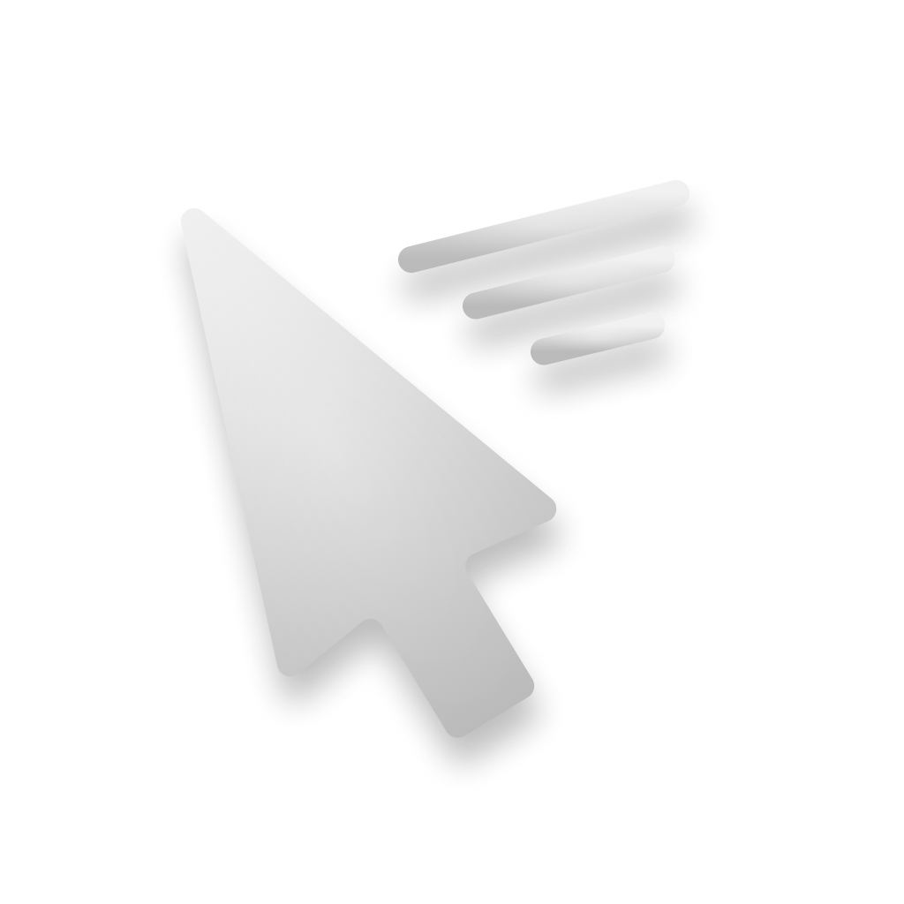

<p align="center">
  
</p>

<h1 align="center">MouseGestures</h1>

<p align="center">
  <strong>Mouse, trackpad & keyboard gestures for macOS</strong><br>
  Hold a button, swipe a direction, fire an action - without leaving the mouse.
</p>

<p align="center">
  <a href="#features">Features</a> ·
  <a href="#installation">Install</a> ·
  <a href="#usage">Usage</a> ·
  <a href="#configuration">Config</a> ·
  <a href="#security">Security</a> ·
  <a href="#license">License</a>
</p>

<p align="center">
  
  
  
  
</p>

---

## Why?

macOS gives trackpad users a rich gesture vocabulary. Mouse users mostly get scroll wheels and a context menu.

**MouseGestures** fills that gap: hold a trigger, drag in a direction, release - and run a shortcut, a shell command, or AppleScript. The same muscle memory works across browsers, editors, and the system.

```
Right-button  +  ←   →  ⌘[   (Back)
Right-button  +  →   →  ⌘]   (Forward)
Right-button  +  ↑   →  ⌘ Page Up
Right-button  +  ↓   →  ⌘ Page Down
```

---

## Features

| | |
|---|---|
| **🖱 Mouse gestures** | Any button (left, right, middle, X1/X2, or custom). Eight directions including diagonals. |
| **✋ Trackpad** | Swipes, pinch, rotate, smart zoom - with system presets (Mission Control, App Exposé, …). |
| **⌨️ Hotkeys** | Global keyboard shortcuts that fire actions instantly. |
| **🔑 Hold key + drag** | Hold a key combo, move the mouse, release to confirm direction. |
| **⚡ Actions** | Key combo · Shell (`/bin/sh -c`) · AppleScript · or none. |
| **👁 Feedback overlay** | Minimal circle + arrow under the cursor; system cursor hides while tracking. |
| **🎛 Preferences** | SwiftUI settings, shortcut recorder, gesture editor, permission status. |
| **📌 Menu bar** | Lightweight accessory app - no Dock icon. Enable / feedback / launch at login / quit. |
| **💾 JSON config** | Atomic save, size limits, file permissions `0600`, versioned migrations. |
| **🚀 Launch at login** | Modern `SMAppService` (macOS 13+). |

---

## Requirements

- **macOS 13** (Ventura) or later  
- **Accessibility** - mouse button capture & key synthesis  
- **Input Monitoring** - keyboard shortcuts and trackpad gestures  
- To build: **Xcode** or Command Line Tools (`swift`)

---

## Installation

### Build from source

```bash
git clone https://github.com/freezy/MouseGestures.git
cd MouseGestures
./scripts/build-app.sh
open build/MouseGestures.app
```

On first launch:

1. Grant **Accessibility** when prompted  
2. Grant **Input Monitoring** if you use hotkeys / trackpad  
3. Re-open the app if macOS asks you to (especially after Input Monitoring)

> **Gatekeeper:** self-signed local builds may need  
> *System Settings → Privacy & Security → Open Anyway*,  
> or: `xattr -cr build/MouseGestures.app`

### Development run

```bash
swift run
```

Prefer the packaged `.app` for realistic menu-bar and permission behaviour.

---

## Usage

1. Click the **menu bar** icon → **Preferences…**
2. Open the **Gestures** tab → **Add Gesture**
3. Pick a **trigger** (mouse / trackpad / hotkey / hold key)
4. Choose a **direction** (when applicable)
5. Set an **action** (record a shortcut, or write shell / AppleScript)
6. Hold the trigger, drag, release - done

### Default bindings

| Gesture | Action |
|---------|--------|
| Right-button → Left | ⌘← |
| Right-button → Right | ⌘→ |
| Right-button → Up | ⌘ Page Up |
| Right-button → Down | ⌘ Page Down |

Everything is editable. Reset to defaults anytime from Preferences.

---

## Configuration

Path:

```text
~/Library/Application Support/MouseGestures/config.json
```

Created on first save. Reveal it via **Preferences → Gestures → Show config in Finder**.

### Example (v3)

```json
{
  "version": 3,
  "enabled": true,
  "defaultTrigger": {
    "kind": "mouseButton",
    "buttonNumber": 1,
    "customName": "Right"
  },
  "activationThreshold": 60,
  "showFeedback": true,
  "launchAtLogin": false,
  "directionUpdateDelay": 0.03,
  "gestures": [
    {
      "id": "00000000-0000-0000-0000-000000000001",
      "trigger": {
        "kind": "mouseButton",
        "buttonNumber": 1,
        "customName": "Right"
      },
      "direction": "left",
      "action": {
        "keyCombo": {
          "keyCode": 123,
          "modifiers": ["command"]
        }
      }
    }
  ]
}
```

### Action types

| Type | Behaviour |
|------|-----------|
| `keyCombo` | Posts a virtual key with modifiers (`command`, `control`, `option`, `shift`) |
| `shell` | Runs `/bin/sh -c "…"` · **5s timeout** · runs as your user |
| `appleScript` | Runs via `osascript` · **5s timeout** |
| `none` | No-op |

### Tuning

| Setting | Meaning |
|---------|---------|
| **Activation threshold** | How far (pt) the pointer must travel to commit a direction |
| **Direction update delay** | Debounce when the arrow switches mid-drag (`0` = snappiest) |
| **Show feedback overlay** | Circle + arrow under the cursor while tracking |

---

## Permissions

| Permission | Used for |
|------------|----------|
| **Accessibility** | Global mouse event tap, injecting key combos |
| **Input Monitoring** | Global hotkeys, trackpad gesture stream |

Without Accessibility, the engine cannot start.  
Without Input Monitoring, **mouse gestures still work**; hotkeys and trackpad triggers are disabled until access is granted.

---

## Security

MouseGestures is a **power-user tool**, not a sandboxed App Store app. Global event taps and Accessibility are incompatible with sandboxing.

- Shell & AppleScript run **with your user privileges** - only save commands you trust  
- Dangerous actions show a **confirmation** when saving in Preferences  
- Config file is capped at **256 KB**, written atomically, mode **`0600`**  
- Process stdout is not fully logged; stderr snippets use private logging  
- Review any binary before granting Accessibility / Input Monitoring  

> If you did not build it yourself, treat it like any privileged utility: read the source, build from a tag you trust.

---

## Architecture

```text
Sources/MouseGestures/
├── App.swift / AppDelegate.swift      # Lifecycle & wiring
├── StatusBarController.swift          # Menu bar
├── Core/
│   ├── GestureEngine.swift            # Event tap, monitors, matching
│   ├── GestureRecognizer.swift        # Delta → 8-way direction
│   ├── Trigger.swift / TriggerButton  # Mouse · trackpad · keys
│   └── Direction.swift
├── Actions/
│   ├── Action.swift / KeyCombo.swift
│   └── ActionExecutor.swift           # Keys · shell · AppleScript
├── Configuration/
│   ├── Configuration.swift / Gesture.swift
│   ├── ConfigStore.swift
│   └── SystemGestureTemplate.swift
├── System/
│   ├── Permissions.swift
│   └── LaunchAtLogin.swift
└── UI/
    ├── PreferencesView.swift          # SwiftUI
    ├── FeedbackOverlayController.swift
    └── KeyComboRecorder.swift
```

Tests live under `Tests/MouseGesturesTests/` (recognizer, config, actions).

```bash
swift test   # needs full Xcode (XCTest), not CLT alone
```

---

## Roadmap

- [ ] Per-app gesture profiles  
- [ ] Multi-segment / L-shape gestures  
- [ ] Sparkle auto-updates  
- [ ] Notarized release builds  
- [ ] Localization (EN + RU first)

---

## Contributing

Issues and PRs are welcome. For non-trivial changes, open an issue first so we can align on approach.

```bash
swift build
./scripts/build-app.sh
swift test   # when Xcode is installed
```

---

## License

[MIT](LICENSE) © 2026 MouseGestures contributors

---

<p align="center">
  <sub>Made for people who never put the mouse down.</sub>
</p>
